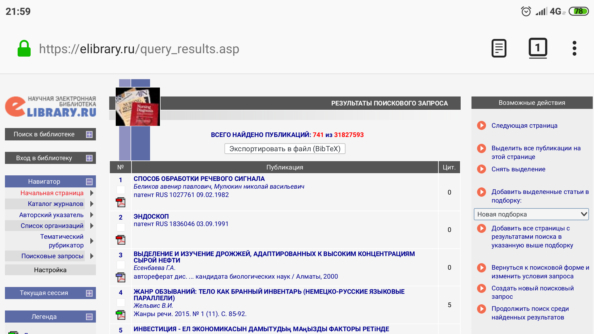

# Средство экспорта библиографических записей из eLIBRARY.RU (СЕБЗЕР)

> The Sebzer [Tampermonkey](https://tampermonkey.net) script provides citation export support for [eLIBRARY.RU](https://elibrary.ru) ([Russian Science Citation Index](https://en.m.wikipedia.org/wiki/Russian_Science_Citation_Index)), a Russian PubMed-MEDLINE-like (with a broader coverage though) free-to-use national bibliographic database.
> 
> The tool is in beta, only batch BibTeX export from search query result pages is supported yet; the only yet supported record type is `«статьи в журналах»` [journal articles].
> 
> If you strongly feel such a tool or such a database in general needs getting translated into English, too, please follow up in [the corresponding translation issue](http://github.com/p1m-ortho/xs-sebzer/issues/4).

Скрипт для [Tampermonkey](https://tampermonkey.net). Инструкции по установке см. там же или в интернетах.

Добавляет в [eLIBRARY.RU](https://elibrary.ru) возможности экспорта библиографических записей, подобные таковым в [PubMed](https://pubmed.gov).

В настоящее время поддерживается экспорт только со страниц результатов поискового запроса, только с ограничением по типу публикации `«статьи в журналах»` и только в формате [BibTeX](https://ru.wikipedia.org/wiki/BibTeX#Библиографические_базы:_bib-файлы).

> If correctly set up, the script will pop an `Экспортировать в файл (BibTeX)` [Export to a file (BibTeX)] button just before the first search query result, as shown:

При корректной настройке скрипта сразу перед первым результатом поисковой выдачи появится кнопка `Экспортировать в файл (BibTeX)`, вот так:

> Next, the browser will prompt to save an `elibrary_ru.bib` file containing all the records from the current search output page.

Далее браузер предложит сохранить файл `elibrary_ru.bib`， содержащий все записи с текущей страницы поисковой выдачи.

-----

Не забудьте также заценить наши [CSL-стили для ГОСТ 7.1–2003 «Библиографическая запись»](https://github.com/p1m-ortho/styles/blob/ba7d5eb5ad5ca73416a08c9c67c05a91b6e94538/russian-gost-71-2003-alpha.csl) (для диссертаций).

Вооружившись СЕБЗЕР-ом и этими стилями в сочетании с какой-нибудь библиографической программой (достаточно и [R Studio](https://rstudio.com), в частности), можно литературно обогатить вашу диссертацию без особых хлопот.
